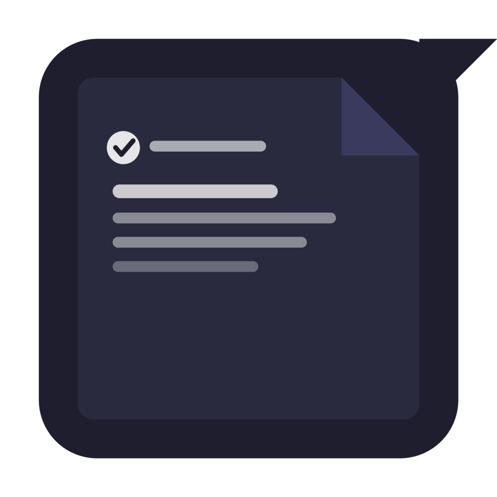
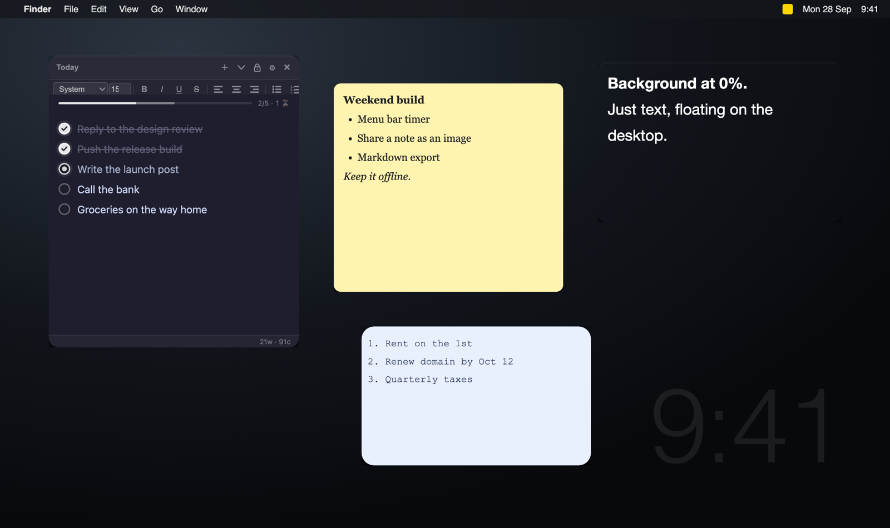

<p align="center">
  
</p>

<h1 align="center">FreeStickies</h1>

<p align="center"><b>Free, offline sticky notes for macOS that float on your desktop.</b></p>

<p align="center">
  <a href="LICENSE"></a>
  
  
  <a href="https://claude.com/claude-code"></a>
</p>

<p align="center">
  
</p>

## Why

The sticky-note apps I tried wanted a monthly subscription for something this simple. So I
built one that costs nothing, needs no account, and keeps every note on your Mac.

FreeStickies is vibe coded with [Claude](https://claude.com/claude-code). Not a line of it was written by hand.

## Features

- **As many notes as you want,** each in its own frameless window that stays above other apps.
- **Gets out of the way.** The toolbar hides when a note is not focused, so you only see what
  you wrote.
- **Transparency two ways.** Fade the background down to 0% for text that floats on the
  desktop, or dim the whole window.
- **Rich text:** bold, italic, underline, strikethrough, fonts, sizes, text colour, and
  alignment.
- **Lists:** bullets, numbers, indent and outdent with Tab.
- **Three-state checkboxes** that cycle from to-do to in progress to done, with a progress bar
  that appears on any note with a checklist.
- **Make each note yours:** any background colour, adjustable corner roundness.
- **Lock** a note against accidental edits, **collapse** it to its title bar, or **duplicate** it.
- **Copy as Markdown,** plus a live word and character count.
- **Lives in the menu bar.** No Dock icon.
- **Nothing is lost.** Notes, positions and sizes are saved as you type and come back after a
  restart.

### Shortcuts

| Keys | Action |
|---|---|
| ⌘N | New note |
| ⌘B, ⌘I, ⌘U | Bold, italic, underline |
| Tab, Shift-Tab | Indent, outdent |

## Install

1. Download **FreeStickies.dmg** from the [latest release](https://github.com/hussaintrawadi/stickies/releases/latest).
   It runs on Apple Silicon Macs (M1 and later).
2. Open it and drag **FreeStickies** to Applications.
3. The first time you open it, macOS says it cannot check the app for malware, because it is not
notarised by Apple. Open **System Settings → Privacy & Security**, scroll down, and click
**Open Anyway**. You only do this once.

### Build it yourself

```bash
git clone https://github.com/hussaintrawadi/stickies.git
cd stickies
npm install
npm run dist
```

That creates `dist/FreeStickies.dmg`, with the app icon made from `icon.png`. On an Intel Mac,
this builds an Intel version. To try it without building, run `npm start`.

## Where your notes live

Everything is in one JSON file on your Mac:

```
~/Library/Application Support/free-stickies/free-stickies-notes.json
```

There is no sync, no account and no network access. Back that file up if your notes matter.

## Project structure

| File | What it does |
|------|-------------|
| `main.js` | Electron main process: windows, the menu bar icon, saving notes |
| `preload.js` | The small, isolated bridge between each note and the main process |
| `note.html` | The whole note UI in one file: HTML, CSS and JavaScript |
| `build-dmg.sh` | Builds `dist/FreeStickies.app` and a styled DMG |
| `package.json` | App manifest and scripts |

Each note window runs with `contextIsolation` on and `nodeIntegration` off, and only talks to
the main process through the functions in `preload.js`.

## Contributing

Issues and pull requests are welcome. Keep it offline and dependency-light: the app has one
runtime dependency, Electron, and that is on purpose.

## License

[MIT](LICENSE). Built by [Hussain Trawadi](https://github.com/hussaintrawadi), vibe coded with [Claude](https://claude.com/claude-code).
